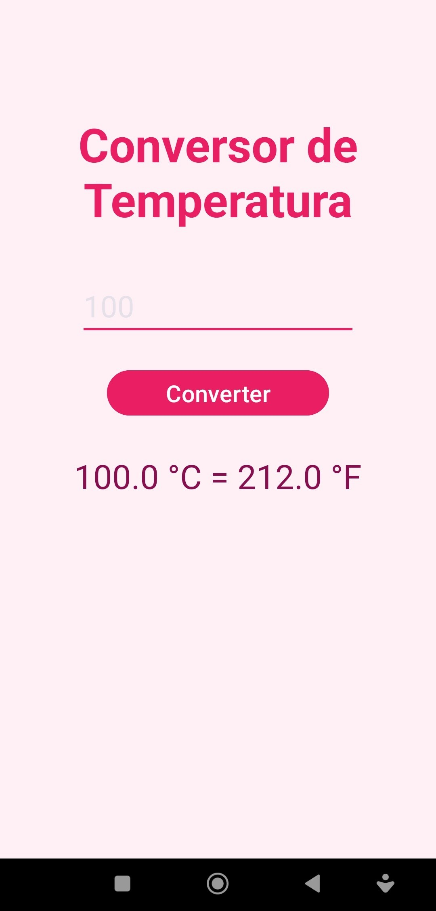
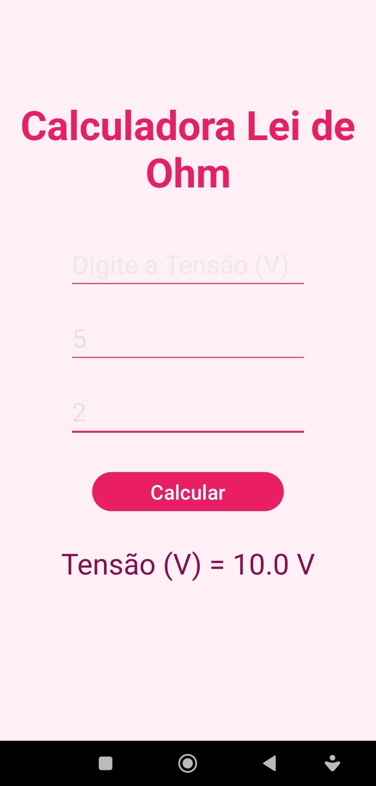
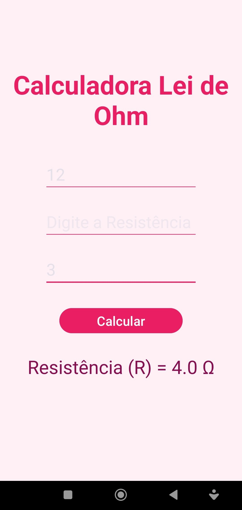

# 📱 App Android - Exercícios Kotlin 
 
Aplicativo Android desenvolvido em **Kotlin** com três funcionalidades independentes: mensagem de boas-vindas, conversor de temperatura e calculadora da Lei de Ohm.
 
---
 
## 📋 Funcionalidades
 
### 1. 👋 Tela de Boas-Vindas (`BemVindoActivity`)
O usuário informa seu **nome** e **idade** em dois campos de texto. Ao clicar no botão, um Toast exibe a mensagem de boas-vindas personalizada.
 
**Comportamento:**
- Campos preenchidos → exibe `"Bem-vindo [nome]! Você tem [idade] anos."`
- Campos vazios → exibe `"Preencha todos os campos!"`
---
 
### 2. 🌡️ Conversor de Temperatura (`ConversorActivity`)
Converte uma temperatura inserida em **Celsius** para **Fahrenheit**.
 
**Fórmula utilizada:**
```
°F = (°C × 9/5) + 32
```
 
**Comportamento:**
- Campo preenchido → exibe o resultado em um `TextView` (`"X °C = Y °F"`)
- Campo vazio → exibe `"Digite uma temperatura!"`
---
 
### 3. ⚡ Lei de Ohm (`LeiOhmActivity`)
Calcula qualquer uma das três grandezas elétricas com base nos dois valores fornecidos.
 
**Fórmula:**
```
V = R × I
```
 
| Entradas fornecidas | Resultado calculado |
|---|---|
| Tensão (V) + Resistência (R) | Corrente: `I = V / R` (em Amperes) |
| Tensão (V) + Corrente (I) | Resistência: `R = V / I` (em Ohms) |
| Resistência (R) + Corrente (I) | Tensão: `V = R × I` (em Volts) |
 
**Comportamento:**
- Exatamente dois campos preenchidos → calcula e exibe o resultado
- Número incorreto de campos → exibe `"Preencha apenas dois valores."`
---
 
## 📸 Screenshots
 
<table>
  <tr>
    <th align="center">👋 Boas-Vindas</th>
    <th align="center">🌡️ Conversor de Temperatura</th>
  </tr>
  <tr>
    <td align="center"></td>
    <td align="center"></td>
  </tr>
</table>
### ⚡ Lei de Ohm
 
<table>
  <tr>
    <th align="center">Calculando Tensão (V)</th>
    <th align="center">Calculando Resistência (R)</th>
    <th align="center">Calculando Corrente (I)</th>
  </tr>
  <tr>
    <td align="center"></td>
    <td align="center"></td>
    <td align="center"></td>
  </tr>
</table>
---
 
## 🗂️ Estrutura do Projeto
 
```
app/src/main/
├── java/br/edu/fatecpg/kotlin/
│   └── view/
│       ├── BemVindoActivity.kt
│       ├── ConversorActivity.kt
│       └── LeiOhmActivity.kt
└── res/
    └── layout/
        ├── activity_bem_vindo.xml
        ├── activity_conversor.xml
        └── activity_lei.xml
```
 
---
 
## 🛠️ Tecnologias
 
- **Linguagem:** Kotlin
- **SDK mínimo:** Android 21+ (Lollipop)
- **Componentes:** `EditText`, `Button`, `TextView`, `Toast`
- **Arquitetura:** Activity-based (sem ViewModel)
---
 
## ▶️ Como executar
 
1. Clone o repositório:
   ```bash
   git clone https://github.com/seu-usuario/seu-repositorio.git
   ```
2. Abra o projeto no **Android Studio**
3. Conecte um dispositivo ou inicie um emulador
4. Clique em **Run ▶️** (ou `Shift + F10`)
---
